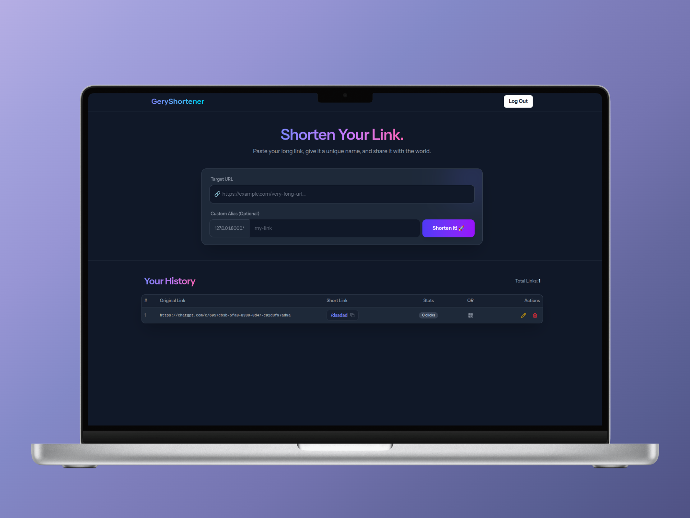
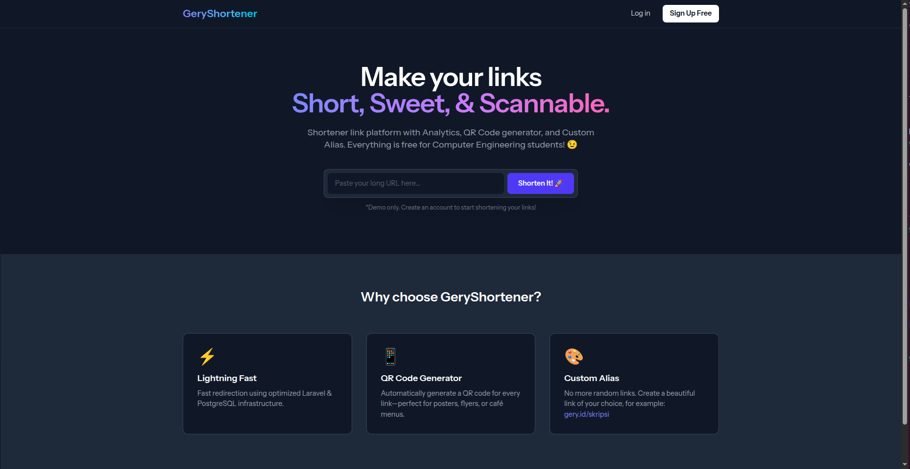
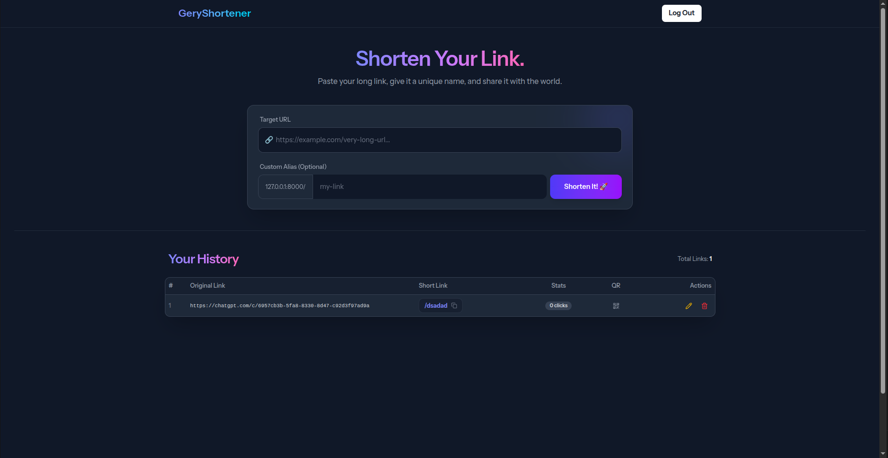

# 🚀 GeryShortener - Modern SaaS URL Shortener

 
> **Platform pemendek link canggih dengan fitur Analytics, QR Code Generator, dan Custom Alias.** > *Built with Laravel, React, and Modern Infrastructure standards.*

## 📖 About The Project

**GeryShortener** adalah aplikasi SaaS (*Software as a Service*) yang dirancang untuk mempermudah manajemen tautan. Tidak hanya sekedar memendekkan URL, aplikasi ini memberikan kontrol penuh kepada pengguna untuk melacak performa link mereka melalui dashboard interaktif.

Proyek ini dibangun untuk mendemonstrasikan integrasi antara **Backend yang kuat (Laravel)** dan **Frontend yang reaktif (React via Inertia.js)**, dengan fokus pada *User Experience (UX)* dan *Database Efficiency*.

### ✨ Key Features

* 🔗 **Shorten URLs:** Generate link pendek acak (`gery.id/xYz12`) secara instan.
* 🎨 **Custom Alias:** Personalisasi link kamu sendiri (contoh: `gery.id/my-portfolio`).
* 📱 **QR Code Generator:** Otomatis membuat QR Code untuk kebutuhan cetak/digital.
* 📊 **Click Analytics:** Pelacakan jumlah klik secara *real-time*.
* ✏️ **Full Management:** Fitur Edit (ubah tujuan URL tanpa ganti link pendek) dan Delete.
* 🌙 **Modern UI:** Tampilan *Dark Mode* dengan desain *Glassmorphism*.
<!-- * 🔐 **Secure Authentication:** Sistem login/register yang aman menggunakan Laravel Breeze. -->

---

## 🛠️ Tech Stack

Project ini dibangun menggunakan teknologi modern standar industri:

**Backend & Infrastructure:**
* **Framework:** [Laravel 12](https://laravel.com)
* **Database:** PostgreSQL (Optimized for scale)
<!-- * **Auth:** Laravel Breeze (Session based) -->

**Frontend:**
* **Core:** [React.js](https://reactjs.org/)
* **Glue:** [Inertia.js](https://inertiajs.com/) (Monolith feel, SPA speed)
* **Styling:** [Tailwind CSS](https://tailwindcss.com/) + Shadcn UI
* **Icons:** Lucide React

---

## 📸 Screenshots

| Landing Page | Dashboard |
|:---:|:---:|
|  |  |
| *Halaman depan modern untuk konversi user* | *Manajemen link dengan fitur QR & Analytics* |


---

## 🚀 Getting Started

Ikuti langkah ini untuk menjalankan proyek di komputer lokal kamu (Localhost).

### Prerequisites
* PHP >= 8.2
* Composer
* Node.js & NPM
* PostgreSQL

### Installation

1.  **Clone Repository**
    ```bash
    git clone [https://github.com/GeryTrstno/Custom-URL-Shortener](https://github.com/GeryTrstno/Custom-URL-Shortener.git)
    cd Custom-URL-Shortener
    ```

2.  **Install Dependencies**
    ```bash
    composer install
    npm install
    ```

3.  **Environment Setup**
    Duplikat file `.env.example` menjadi `.env`:
    ```bash
    cp .env.example .env
    ```
    Buka file `.env` dan sesuaikan koneksi database kamu:
    ```env
    DB_CONNECTION=pgsql
    DB_HOST=127.0.0.1
    DB_PORT=5432
    DB_DATABASE=nama_database_kamu
    DB_USERNAME=postgres
    DB_PASSWORD=password_kamu
    ```

4.  **Generate Key & Migrate**
    ```bash
    php artisan key:generate
    php artisan migrate
    ```

5.  **Run Development Server**
    Buka dua terminal terpisah:
    ```bash
    # Terminal 1 (Backend)
    php artisan serve

    # Terminal 2 (Frontend)
    npm run dev
    ```
    
    atau gunakan:
    ```bash
    composer run dev
    ```

6.  **Selesai!** Buka browser dan akses `http://127.0.0.1:8000`

---

## 🧠 Engineering Highlights

Beberapa tantangan teknis yang diselesaikan dalam proyek ini:

* **Database Indexing:** Kolom `short_code` menggunakan index `unique` untuk memastikan pencarian data super cepat saat redirect, serta mencegah duplikasi kode.
* **Validation Logic:** Menggunakan custom rule `Rule::unique(...)->ignore(...)` saat proses editing untuk memungkinkan user mengupdate URL tujuan tanpa bentrok dengan validasi aliasnya sendiri.
* **React State Management:** Menggunakan *Hooks* (`useState`, `useForm`) untuk menangani Modal (Pop-up) QR Code dan Edit Form tanpa perlu reload halaman.

---

## 🤝 Contributing

Kontribusi sangat terbuka! Jika kamu punya ide fitur baru:
1.  Fork project ini.
2.  Buat branch fitur baru (`git checkout -b fitur-keren`).
3.  Commit perubahan kamu (`git commit -m 'Menambahkan fitur keren'`).
4.  Push ke branch (`git push origin fitur-keren`).
5.  Buat Pull Request.

---

## 📝 License

Distributed under the MIT License. See `LICENSE` for more information.

---

<p align="center">
  Built with ❤️ by <strong>Gery Tauristino</strong>
</p>
